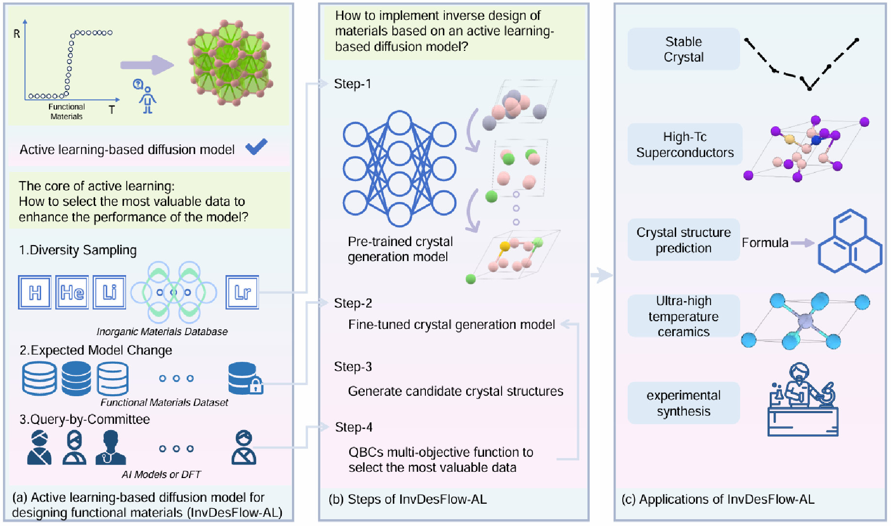

# InvDesFlow-AL (The repository is continuously being updated.)
The discovery of novel functional materials with targeted properties remains a fundamental challenge in materials science. In this work, we propose InvDesFlow-AL, an active learning-based generative framework for inverse materials design, which iteratively optimizes material generation towards desired properties.

[**[Paper]**](https://arxiv.org/pdf/2505.09203)



## Open-Source Models

We have open-sourced these models at [https://zenodo.org/records/15469341](https://zenodo.org/records/15469341).

| File Name                   | Model Description                                                                 |
|----------------------------|------------------------------------------------------------------------------------|
| FormEGNN-weight.hdf5       | Formation energy prediction model for evaluating crystal thermodynamic stability. |
| SuperconGNN-weight.pt      | Superconducting Tc prediction model specialized for ambient-pressure BCN and hydrides. |
| PretrainGenerationModel.ckpt | Pretrained crystal generation model; supports direct generation and fine-tuning for functional materials. |
| CSP-mpts52.ckpt            | Crystal structure prediction model (MP-TS52 dataset).                |
| CSP-mp20.ckpt              | Crystal structure prediction model (MP-20 dataset).                  |
| CSP-perov5.ckpt            | Crystal structure prediction model (perov5 dataset).        |

## Open-Source Data

| Dataset                   | Link                                                   | Description                                                                                           |
| ------------------------- | ------------------------------------------------------ | ----------------------------------------------------------------------------------------------------- |
| Low-Formation-Materials   | [Zenodo 15222702](https://zenodo.org/records/15222702) | 577 113 DFT‑relaxed crystals from 5 active‑learning rounds (generator + DPA‑2 + FormEGNN).            |
| Low‑Ehull‑Materials       | [Zenodo 15221067](https://zenodo.org/records/15221067) | Large set of low‑formation‑energy, compositionally diverse crystals, emphasizing high‑entropy alloys. |
| Candidate‑Superconductors | [Zenodo 14644273](https://zenodo.org/records/14644273) | Collection of candidate superconducting materials.                                                    |


## 📄 Citation
If you use **InvDesFlow-AL** in your research, please cite our work:
```bibtex
@misc{han2025invdesflowalactivelearningbasedworkflow,
  title     = {InvDesFlow-AL: Active Learning-based Workflow for Inverse Design of Functional Materials}, 
  author    = {Xiao-Qi Han and Peng-Jie Guo and Ze-Feng Gao and Hao Sun and Zhong-Yi Lu},
  year      = {2025},
  eprint    = {2505.09203},
  archivePrefix = {arXiv},
  primaryClass  = {cond-mat.mtrl-sci},
  url       = {https://arxiv.org/abs/2505.09203},
}
```
